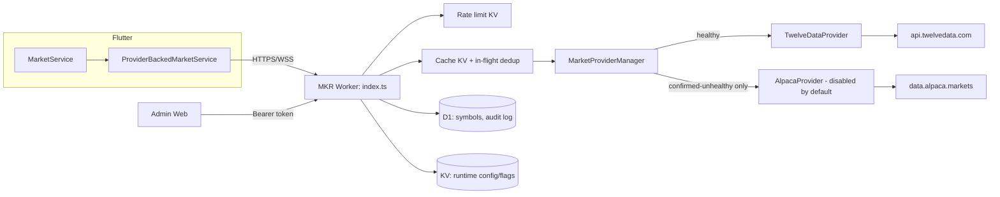
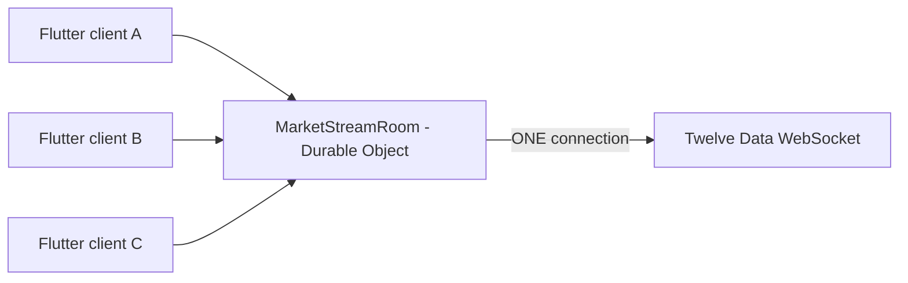

# MKR Phase 2 — Backend Architecture

## Why this exists

Phase 1 built the Flutter-side provider abstraction
(`TwelveDataProvider`/`AlpacaProvider`/`MarketProviderManager`) against a
backend that didn't exist yet, deliberately pointed at a configurable
`backendBaseUrl` so "real" mode would honestly report offline until a real
gateway existed. Phase 2 builds that gateway: a single Cloudflare Worker
(`backend/`) that owns every call to Twelve Data/Alpaca, so the API key
never has to leave a server, and a lightweight Admin Web (`admin/`) to
operate it without editing source code.

## Repository decision

Two Cloudflare backends already exist on this machine:
`D:\FlutterProjects\auc\backend` (a separate, live production Worker for a
different app, `com.sarayuth369.auc`). It was inspected again this phase —
same conclusion as Phase 1 planning: it is not MKR-intended infrastructure,
just a superficially similar name ("SMC") the product owner used loosely.
Modifying a different paid app's production Worker for MKR's benefit would
be exactly the kind of blast-radius mistake the "inspect first" instruction
exists to prevent. **This phase creates a new, isolated Worker
(`mkr-backend`)** instead — deployable under the same Cloudflare account,
no new account created, `auc-backend` completely untouched.

## Request flow

## WebSocket fan-out

A plain Worker invocation has no memory across requests, so it cannot hold
a persistent outbound WebSocket shared by many inbound clients. A Durable
Object is the Cloudflare-native primitive built exactly for this: one
`MarketStreamRoom` instance (`durable_objects.bindings` in `wrangler.toml`)
owns the single upstream connection, ref-counts which MKR symbols any
client still needs, and unsubscribes/disconnects upstream once nobody does.
Heartbeat and reconnect-with-backoff are driven by the Durable Object Alarm
API (`alarm()` in `market-stream-do.ts`), since Workers/DOs have no
persistent `setInterval` across suspensions.

## Two enums, on purpose (again)

Phase 1 established that "is the market open" (`MarketSessionStatus`) and
"is our data pipe healthy" (`MarketDataMode`/provider health) must never be
conflated — otherwise a quiet closed market looks identical to a dead
connection and triggers a false failover. Phase 2 preserves this exactly:
`MarketProviderManager.withFailover` only ever fails over after a genuine
thrown `ProviderError` is *confirmed* by a fresh `healthCheck()` call — an
empty-but-successful response (`getQuote` returning `null`) is not an
error at all, just a value, and is cached and returned as `data: null`.

## Design tradeoffs (documented, not hidden)

- **Cache dedup is KV-based, not Durable-Object-based.** KV has no
  compare-and-swap, so two isolates can both miss the cache in the same
  instant and each make one upstream call. This is bounded ("a small
  constant number of extra calls", never "one call per user") and was
  judged not worth a second Durable Object for an early-stage product's
  cache layer — a documented future enhancement, not a gap that was missed.
- **Provider health is in-memory per isolate**, refreshed live on
  `/api/mkr/market/health` rather than durably persisted to KV on every
  request (which would burn through KV's write quota for no benefit to
  correctness). `errorCount`/`lastErrorAt` reset on a cold start — acceptable
  for an operational dashboard, not used for any correctness-critical logic.
- **Rate limiting is a KV fixed-window counter**, not Cloudflare's native
  Workers Rate Limiting binding — portable, requires no special account
  feature, and is an explicit drop-in swap later if stricter enforcement is
  needed (see `src/ratelimit.ts`'s doc comment).
- **One WebSocket room today.** If a single upstream Twelve Data
  connection's subscribed-symbol limit ever becomes a real constraint,
  sharding `MarketStreamRoom` by symbol-set is the natural next step — not
  built now, per the "avoid overengineering" instruction.
- **Admin has one shared login**, not per-admin accounts/roles. `ADMIN_FORBIDDEN`
  is defined and reachable (auth not configured) but there is no
  role-based access control yet — reasonable for a single product owner
  operating this Worker today.

## Flutter-side integration

`TwelveDataProvider`/`TwelveDataParser` (Flutter) were updated to consume
the backend's actual normalized envelope (`{"success", "data"}` with
`price`/`changePercent`/`previousClose`/... field names) instead of the
Phase-1-era guess at a raw Twelve-Data-shaped passthrough — this is the one
place Phase 1's speculative contract had to change now that a real
contract exists (see `errorResponse`/`NormalizedQuote` in
`backend/src/types.ts` vs. the parser in
`lib/features/markets/data/providers/twelve_data_parser.dart`). Symbol
mapping also moved server-side: Flutter now sends plain MKR symbols and the
backend's `SymbolCatalog`/`mapSymbolFromRows` resolve the provider symbol,
so Flutter's `SymbolMapper` is no longer used by `TwelveDataProvider` (it
remains in place for `AlpacaProvider`, see Limitations below).
`MarketService`, `MarketDetailController`, and every screen are unchanged —
they only ever depended on the `MarketService` interface.

## Known limitation carried into Phase 3

Flutter's client-side `AlpacaProvider` still targets a standalone
`/api/mkr/alpaca/*` contract designed in Phase 1 before the real backend
existed. The Phase 2 backend does **not** expose separate Alpaca routes —
Alpaca failover happens transparently inside the backend's
`MarketProviderManager` on the same `/api/mkr/market/*` endpoints. Since
Flutter's own secondary provider is disabled by default in its own wiring
too, this mismatch is latent and harmless today, but should be reconciled
(most likely: delete Flutter's client-side `AlpacaProvider`/`SymbolMapper`/
`MarketProviderManager` entirely once the backend gateway is the only
active path, since the backend now owns that failover decision) in a
follow-up cleanup rather than guessed at further in this already-large change.
