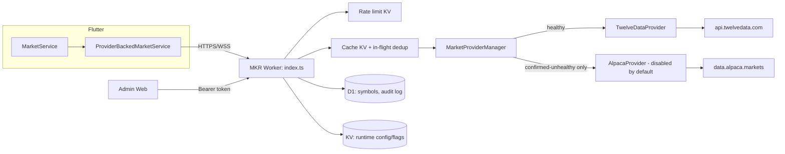
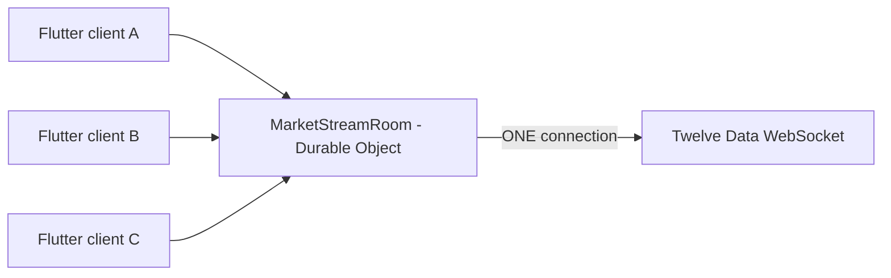

# MKR Phase 2 — Backend Architecture

## Why this exists

Phase 1 built the Flutter-side provider abstraction
(`TwelveDataProvider`/`AlpacaProvider`/`MarketProviderManager`) against a
backend that didn't exist yet, deliberately pointed at a configurable
`backendBaseUrl` so "real" mode would honestly report offline until a real
gateway existed. Phase 2 builds that gateway: a single Cloudflare Worker
(`backend/`) that owns every call to Twelve Data/Alpaca, so the API key
never has to leave a server, and a lightweight Admin Web (`admin/`) to
operate it without editing source code.

## Repository decision

Two Cloudflare backends already exist on this machine:
`D:\FlutterProjects\auc\backend` (a separate, live production Worker for a
different app, `com.sarayuth369.auc`). It was inspected again this phase —
same conclusion as Phase 1 planning: it is not MKR-intended infrastructure,
just a superficially similar name ("SMC") the product owner used loosely.
Modifying a different paid app's production Worker for MKR's benefit would
be exactly the kind of blast-radius mistake the "inspect first" instruction
exists to prevent. **This phase creates a new, isolated Worker
(`mkr-backend`)** instead — deployable under the same Cloudflare account,
no new account created, `auc-backend` completely untouched.

## Request flow



## WebSocket fan-out



A plain Worker invocation has no memory across requests, so it cannot hold
a persistent outbound WebSocket shared by many inbound clients. A Durable
Object is the Cloudflare-native primitive built exactly for this: one
`MarketStreamRoom` instance (`durable_objects.bindings` in `wrangler.toml`)
owns the single upstream connection, ref-counts which MKR symbols any
client still needs, and unsubscribes/disconnects upstream once nobody does.
Heartbeat and reconnect-with-backoff are driven by the Durable Object Alarm
API (`alarm()` in `market-stream-do.ts`), since Workers/DOs have no
persistent `setInterval` across suspensions.

## Two enums, on purpose (again)

Phase 1 established that "is the market open" (`MarketSessionStatus`) and
"is our data pipe healthy" (`MarketDataMode`/provider health) must never be
conflated — otherwise a quiet closed market looks identical to a dead
connection and triggers a false failover. Phase 2 preserves this exactly:
`MarketProviderManager.withFailover` only ever fails over after a genuine
thrown `ProviderError` is *confirmed* by a fresh `healthCheck()` call — an
empty-but-successful response (`getQuote` returning `null`) is not an
error at all, just a value, and is cached and returned as `data: null`.

## Design tradeoffs (documented, not hidden)

- **Cache dedup is KV-based, not Durable-Object-based.** KV has no
  compare-and-swap, so two isolates can both miss the cache in the same
  instant and each make one upstream call. This is bounded ("a small
  constant number of extra calls", never "one call per user") and was
  judged not worth a second Durable Object for an early-stage product's
  cache layer — a documented future enhancement, not a gap that was missed.
- **Provider health is in-memory per isolate**, refreshed live on
  `/api/mkr/market/health` rather than durably persisted to KV on every
  request (which would burn through KV's write quota for no benefit to
  correctness). `errorCount`/`lastErrorAt` reset on a cold start — acceptable
  for an operational dashboard, not used for any correctness-critical logic.
- **Rate limiting is a KV fixed-window counter**, not Cloudflare's native
  Workers Rate Limiting binding — portable, requires no special account
  feature, and is an explicit drop-in swap later if stricter enforcement is
  needed (see `src/ratelimit.ts`'s doc comment).
- **One WebSocket room today.** If a single upstream Twelve Data
  connection's subscribed-symbol limit ever becomes a real constraint,
  sharding `MarketStreamRoom` by symbol-set is the natural next step — not
  built now, per the "avoid overengineering" instruction.
- **Admin has one shared login**, not per-admin accounts/roles. `ADMIN_FORBIDDEN`
  is defined and reachable (auth not configured) but there is no
  role-based access control yet — reasonable for a single product owner
  operating this Worker today.

## Flutter-side integration

`TwelveDataProvider`/`TwelveDataParser` (Flutter) were updated to consume
the backend's actual normalized envelope (`{"success", "data"}` with
`price`/`changePercent`/`previousClose`/... field names) instead of the
Phase-1-era guess at a raw Twelve-Data-shaped passthrough — this is the one
place Phase 1's speculative contract had to change now that a real
contract exists (see `errorResponse`/`NormalizedQuote` in
`backend/src/types.ts` vs. the parser in
`lib/features/markets/data/providers/twelve_data_parser.dart`). Symbol
mapping also moved server-side: Flutter now sends plain MKR symbols and the
backend's `SymbolCatalog`/`mapSymbolFromRows` resolve the provider symbol,
so Flutter's `SymbolMapper` is no longer used by `TwelveDataProvider` (it
remains in place for `AlpacaProvider`, see Limitations below).
`MarketService`, `MarketDetailController`, and every screen are unchanged —
they only ever depended on the `MarketService` interface.

## Deployment findings (real bugs only live testing could catch)

Deploying to a real Cloudflare account and actually running the compiled
Flutter app against it (not just curl) surfaced several defects no amount
of unit testing against mocks would have caught, each fixed and covered by
a regression test:

1. **KV's hard 60-second `expirationTtl` floor.** The health-snapshot cache
   used a 10s TTL; KV rejected the write outright. Fixed by clamping in
   `cache-service.ts` and raising every cache-TTL default that was below 60s.
2. **Mutating a WebSocket-upgrade `Response`'s headers breaks the handshake.**
   `index.ts` was adding CORS/`X-Request-Id` headers to every response
   including the 101 upgrade response for `/api/mkr/market/stream`, which
   the client saw as an immediate abnormal close (code 1006). Fixed by
   returning that one route's response untouched, before the generic
   header-mutation logic.
3. **"Illegal invocation" from an unbound `fetch` reference.** Both
   providers stored `private readonly fetchImpl: typeof fetch = fetch` as a
   constructor default; calling it later as `this.fetchImpl(...)` loses the
   `this` binding the Workers runtime's `fetch` implementation requires.
   Fixed with `fetch.bind(globalThis)`.
4. **A connect-vs-query race on the Flutter side.** `MarketProviderManager`
   only set `_active` once its async `connect()` resolved, but every
   controller calls `getAllQuotes()`/`getQuote()` immediately in its own
   constructor — reliably losing that race and seeing `_active == null`
   forever (an empty, error-free result, not a crash - the hardest kind of
   bug to notice). Fixed with an `ensureConnected()` that every data method
   awaits, sharing one in-flight connection attempt.
5. **A concurrent-failure-storm corrupting shared state.** `getAllQuotes()`
   fires every catalog symbol concurrently; several unsupported/unmapped
   symbols returning null in the same instant each independently triggered
   their own `healthCheck()` call, and any one of those being slow enough
   could spuriously null out `_active` for the whole manager - observed
   live as real prices rendering correctly while the status chip
   simultaneously read "PROVIDER UNAVAILABLE." Fixed by deduplicating
   concurrent failure-handling into one shared in-flight check.
6. **N individual REST calls instead of one batched call.** `getQuotes()`
   (Flutter and backend both) looped a per-symbol call rather than using
   the batch endpoint/upstream support that already existed - for a ~28-
   symbol catalog load this alone exhausted Twelve Data Free's rate limit
   immediately, independent of bug 5. Fixed by having both layers call
   Twelve Data's comma-separated `/quote` support (chunked at 8 provider
   symbols per upstream call - see `backend/README.md`'s "Known limitation"
   for why 8, not a bigger number).

## Phase 2.1 – 2.4: User data, alerts, push, admin expansion

Market data stays entirely on the Cloudflare path described above.
Everything user-owned (auth, profile, watchlist, alerts, devices,
notification history, subscription state) is a **separate** system —
Supabase — never mixed with market-price streaming:

```
Flutter
   │
   ├── Market Data ──────────────► MKR Cloudflare Worker ──► Twelve Data
   │                                       │
   │                                       ├─ MarketStreamRoom (DO) ─► every tick
   │                                       │        │
   │                                       │        ▼
   │                                       │   Alert Engine (evaluateTick)
   │                                       │        │  reads KV-cached index only
   │                                       │        ▼
   │                                       │   PushProvider (FcmPushProvider /
   │                                       │                 DisabledPushProvider)
   │                                       │        │
   │                                       │        ▼
   │                                       │   Android device (FCM)
   │                                       │
   └── User Data ───────────────► Supabase (Auth, profiles, watchlists,
                                            alerts, devices, notification_logs,
                                            preferences, subscriptions)
                                       ▲
                                       │ service-role reads (backend only)
                                       │
                              MKR Worker: Cron Trigger (1/min) refreshes the
                              alert index; Admin routes (Users/Alerts/Push/
                              Notification Logs/Subscriptions)
```

### Alert Engine: the "cached/indexed boundary"

Evaluating every market tick against Supabase directly would mean one
Supabase query per tick per symbol - potentially every second, for every
active symbol. Instead:

1. A **Cron Trigger** (`[triggers] crons = ["*/1 * * * *"]` in
   `wrangler.toml`, `scheduled()` in `index.ts`) calls `refreshAlertIndex()`
   once a minute, which reads all `enabled = true` rows from Supabase's
   `alerts` table and writes them into ONE KV document
   (`alerts:index`, 180s TTL) grouped by symbol.
2. `MarketStreamRoom.handleUpstreamMessage` (the single place every tick
   from the one shared upstream connection arrives, independent of whether
   any Flutter client is open) calls `evaluateTick(env, symbol, price)`
   fire-and-forget after fanning the tick out to clients.
3. `evaluateTick` reads **only** the KV-cached index - never Supabase - so
   tick evaluation cost is O(1) KV reads regardless of tick rate.
4. On a genuine trigger (condition met + cooldown elapsed + not already
   in-flight in this isolate), it calls the configured `PushProvider`, logs
   the attempt to `notification_logs`, and best-effort persists
   `last_triggered_at` back to Supabase.

**Scalability path (documented, not built - avoids overengineering an
early-stage product):** once alert volume outgrows one KV value, shard the
index by symbol (`alerts:index:<SYMBOL>`) so a tick only reads its own
symbol's key, or replace the poll with a Durable-Object-held index
invalidated by a Supabase webhook instead of a fixed 1-minute cron.

### Push: FCM is transport only

`PushProvider` is an interface (`backend/src/push/push-provider.ts`) with
two implementations: `FcmPushProvider` (real FCM HTTP v1, hand-signs its own
OAuth2 JWT via WebCrypto - no SDK dependency) and `DisabledPushProvider`
(always returns `{success:false, error:'push_not_configured'}`, never a
fake success). `getPushProvider(env)` picks based on whether
`FCM_PROJECT_ID`/`FCM_CLIENT_EMAIL`/`FCM_PRIVATE_KEY` are all present.
Firebase Cloud Messaging is never confused with a user database - Supabase
remains the only source of truth for who a device belongs to.

On the Flutter side, `PushNotificationService`/`DeviceRepository` are pure
Dart interfaces with `Noop*` defaults - **no `firebase_messaging` package
dependency has been added**, since doing so requires
`android/app/google-services.json` and native Gradle changes that could
break the build without a real Firebase project. `AuthController` calls
`registerDevice()`/`deactivateDevice()` around login/logout; today this is
an end-to-end no-op (Noop push service never returns a token), and becomes
real the moment a `firebase_messaging`-backed `PushNotificationService`
replaces the Noop one - see `docs/MKR-EXTERNAL-INTEGRATIONS.md`.

### Admin expansion fails safe, not open

Every Phase 2.4 admin route (Users, Alerts, Push, Notification Logs,
Subscriptions) checks `supabaseConfigFrom(env)` first and returns
`{ configured: false }` cleanly when Supabase isn't set up, rather than
throwing a 500 or - worse - silently returning empty data that looks the
same as "no data yet." The five new feature flags
(`userAuthEnabled`/`watchlistSyncEnabled`/`alertsEnabled`/
`pushNotificationsEnabled`/`subscriptionEnabled`) default to `false` on a
fresh deploy and gate their surfaces independently of whether the
underlying credential exists - both must be true for a feature to actually
run. Every admin mutation here (alert enable/disable, push sends) is
audit-logged the same way Phase 2's provider/config changes already were;
a mass push additionally requires `{ "confirm": true }` in the request body.

### Guest-first, sync-on-login

"Guest" is a purely client-side concept - `UserProfile.isGuest` - and never
touches Supabase Auth at all. `WatchlistController`/`AlertsController` work
identically whether Supabase is configured or not (`Mock*`/`Supabase*`
implementations behind the same `WatchlistRepository`/`AlertRepository`
interfaces designed in Phase 1). On login, the local watchlist merges into
the user's cloud watchlist exactly once (tracked via
`AppLocalStore.watchlistMergedForUser`, not on every login) to avoid
resurrecting since-deleted symbols. Alert cloud sync is deliberately scoped
to `AlertType.price` only (the one type the backend Alert Engine can
evaluate) - percentage/event/radar alerts stay local-only, a documented
scope-narrowing decision rather than a larger alert-model redesign.

## Known limitation carried into Phase 3

Flutter's client-side `AlpacaProvider` still targets a standalone
`/api/mkr/alpaca/*` contract designed in Phase 1 before the real backend
existed. The Phase 2 backend does **not** expose separate Alpaca routes —
Alpaca failover happens transparently inside the backend's
`MarketProviderManager` on the same `/api/mkr/market/*` endpoints. Since
Flutter's own secondary provider is disabled by default in its own wiring
too, this mismatch is latent and harmless today, but should be reconciled
(most likely: delete Flutter's client-side `AlpacaProvider`/`SymbolMapper`/
`MarketProviderManager` entirely once the backend gateway is the only
active path, since the backend now owns that failover decision) in a
follow-up cleanup rather than guessed at further in this already-large change.
